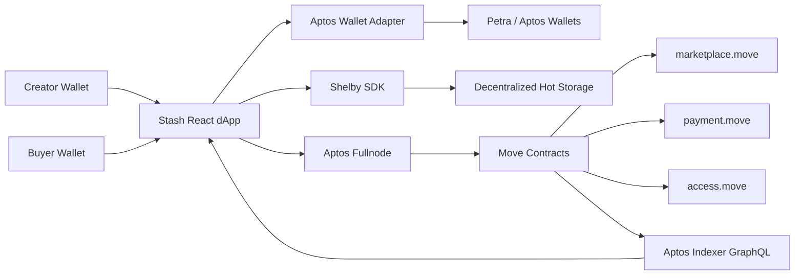
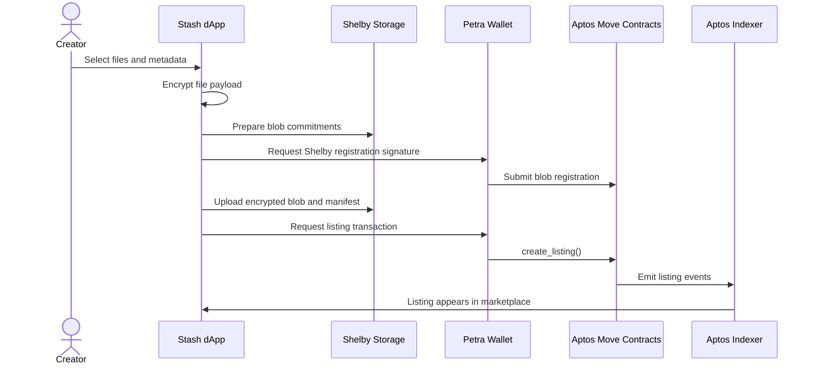
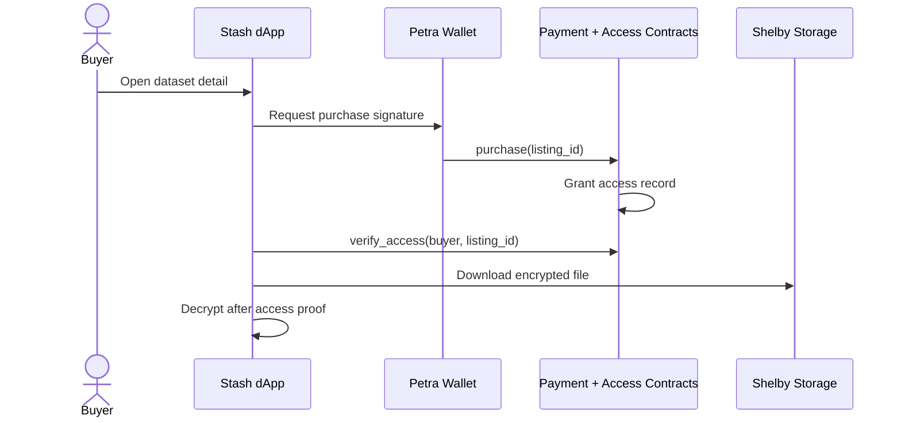

<div align="center">

# Stash

**A decentralized dataset and AI model marketplace on Aptos.**

Stash is a wallet-native marketplace for publishing, buying, and accessing datasets or model artifacts without centralized custody. Files and metadata live on Shelby decentralized hot storage, while ownership, payments, revenue, and access control are enforced on Aptos.

[](https://aptos.dev)
[](https://move-language.github.io/move/)
[](https://docs.shelby.xyz)
[](https://react.dev)

</div>

---

## Why Stash

AI datasets and model artifacts are valuable assets. Most platforms still depend on centralized hosting, account-level permissions, platform fees, and opaque takedown rules. Stash takes a different route:

- **Creators own the listing** through Aptos accounts and Move resources.
- **Files stay decentralized** through Shelby hot storage.
- **Access is paid and verifiable** through on-chain purchase and access records.
- **Revenue settlement is automatic** with protocol fees encoded in contract logic.
- **The UI is built for trust**: clear wallet states, transaction stages, and real loading/error states.

## Product Status

Stash is currently in active development and not yet production-ready.

| Area | Status |
| --- | --- |
| Frontend shell | Built |
| Wallet connection | Working with Petra |
| Upload flow UI | Built |
| Shelby SDK browser integration | Integrated |
| Move contract scaffold | Built |
| Marketplace pages | Built |
| Dashboard pages | Built |
| Full creator E2E | In progress |
| Full buyer E2E | In progress |
| Production deployment | Pending |

Current main blocker: Shelby RPC upload must be verified with the correct network/API-key/runtime configuration.

## Architecture



### Storage Layer

Shelby stores encrypted dataset payloads and metadata manifests. Stash keeps a storage identifier on-chain, not the raw file.

### Contract Layer

Move modules define the marketplace behavior:

| Module | Responsibility |
| --- | --- |
| `marketplace.move` | Listing creation, price updates, delisting, listing events |
| `payment.move` | Purchases, escrow/revenue accounting, protocol fee logic |
| `access.move` | Buyer access grants and access verification |

### Indexing Layer

Aptos Indexer GraphQL is used for marketplace search, dataset pages, dashboard analytics, and event-driven state.

## Core Flows

### Creator Publish Flow



### Buyer Purchase Flow



## Tech Stack

| Layer | Technology |
| --- | --- |
| Frontend | Vite, React, TypeScript |
| Styling | Tailwind CSS, custom design tokens |
| Motion | Framer Motion, GSAP |
| Wallet | Aptos Wallet Adapter, Petra |
| Blockchain | Aptos, Move |
| Storage | Shelby SDK |
| Indexing | Aptos Indexer GraphQL |
| Build | Vite production build with Shelby WASM handling |

## Application Routes

| Route | Purpose |
| --- | --- |
| `/` | Landing page and protocol overview |
| `/marketplace` | Dataset discovery, filters, sorting, indexer-backed grid |
| `/upload` | Creator upload and publish flow |
| `/dataset/:id` | Dataset detail, purchase, access, download |
| `/dashboard` | Creator listings, revenue, transactions, analytics |

## Local Development

### Requirements

- Node.js 20+
- npm
- Aptos CLI
- Petra wallet for browser E2E testing

### Install

```bash
npm install
```

### Run Dev Server

```bash
npm run dev
```

### Typecheck

```bash
npm run typecheck
```

### Production Build

```bash
npm run build
```

### Move Compile / Test

```bash
aptos move compile
aptos move test --skip-fetch-latest-git-deps
```

## Environment Variables

Create `.env.local` for local dApp configuration.

```bash
VITE_APTOS_NETWORK=shelbynet
VITE_APTOS_FULLNODE_URL=https://api.shelbynet.shelby.xyz/v1
VITE_APTOS_INDEXER_URL=https://api.shelbynet.shelby.xyz/v1/graphql
VITE_SHELBY_RPC_URL=https://api.shelbynet.shelby.xyz/shelby
VITE_STASH_MODULE_ADDRESS=0x...

# Optional, depending on network/provider requirements
VITE_APTOS_API_KEY=
VITE_SHELBY_API_KEY=
```

Supported network names in the frontend:

- `shelbynet`
- `testnet`
- `devnet`
- `mainnet`
- `local`

When no network is configured, Stash defaults to `shelbynet`.

## Shelby Browser Notes

The Shelby SDK depends on browser-compatible polyfills and a WASM asset for erasure coding. This repo includes handling for:

- `Buffer` and `process` browser compatibility
- Shelby `clay.wasm` serving through Vite middleware
- Vite dependency optimization exclusions for Shelby packages
- Upload cancellation and non-retryable wallet rejection handling

## Reliability Rules

Stash treats transaction and storage flows as first-class UX:

- Wallet rejection must stop the flow immediately.
- Validation/config errors must not retry silently.
- Shelby RPC 5xx errors may retry only in a limited, explicit way.
- Upload state must be cancellable and resettable.
- Public UI should not present mock data as real marketplace state.

## Project Structure

```text
sources/
  marketplace.move       Move listing module
  payment.move           Move purchase and revenue module
  access.move            Move access-control module

src/
  components/            Shared UI, layout, wallet, tx components
  hooks/                 dApp hooks for Shelby and marketplace actions
  lib/                   Aptos, Shelby, network, format, wallet utilities
  pages/                 Landing, marketplace, upload, detail, dashboard
  styles/                Design tokens and global styling
```

## Deployment Checklist

Before public release:

- Deploy Move modules to the target Aptos network.
- Set `VITE_STASH_MODULE_ADDRESS` to the deployed package address.
- Verify Shelby upload on the target network with a small file.
- Confirm Aptos Indexer events for listing, purchase, access, and claims.
- Run creator E2E: upload, register listing, view listing.
- Run buyer E2E: purchase, verify access, download/decrypt.
- Run production build and route smoke checks.
- Verify no fallback/mock data appears as public marketplace truth.

## License

License is not finalized yet. Treat this repository as proprietary during active development unless a license file is added.

---

<div align="center">

**Stash is built for data ownership, on-chain access, and decentralized distribution.**

</div>
